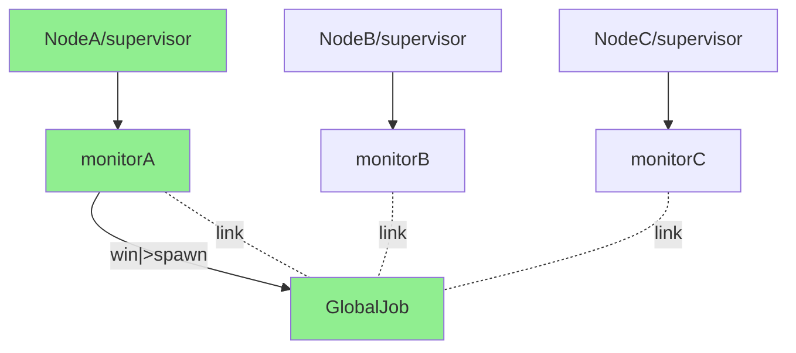

# Unique Job In Cluster

### Precondition

Global jobs depend on [global](http://erlang.org/doc/man/global.html), only allowed to be added statically.

1. Fully Connected Cluster

   Because it depends on `global`'s name registration service, 
   the name server must maintain a fully connected network.

   For example, if node N1 connects to node N2 (which is already connected to N3), 
   the global name servers on nodes N1 and N3 ensure that N1 and N3 are also connected. 
   In other words, the command-line flag `-connect_all false` cannot be used.

2. Same Global Configuration

   All nodes' `global_quorum_size` and `global_jobs` must have the same value. 
   This ensures that the global task manager can transfer between nodes when the network splits.

### Configuration

#### global_jobs
<!-- tabs-open -->
### Erlang
```erlang
%% sys.config
[
   {ecron, [
      {global_jobs, [
         %% {JobName, CrontabSpec, {M, F, A}}
         %% {JobName, CrontabSpec, {M, F, A}, PropListOpts}
         %% CrontabSpec
            %%  1. "Minute Hour DayOfMonth Month DayOfWeek"
            %%  2. "Second Minute Hour DayOfMonth Month DayOfWeek"
            %%  3. @yearly | @annually | @monthly | @weekly | @daily | @midnight | @hourly
            %%  4. @every 1h2m3s
                  
         {basic, "*/15 * * * *", {io, format, ["Runs on 0, 15, 30, 45 minutes~n"]}}         
     ]}     
    }
].
```
### Elixir
Configure ecron in your `config.exs` file with job specifications:
```elixir
# config/config.exs
config :ecron,  
  local_jobs: [
    # {job_name, crontab_spec, {module, function, args}}
    # {job_name, crontab_spec, {module, function, args}, PropListOpts}
    # CrontabSpec formats:
    #  1. "Minute Hour DayOfMonth Month DayOfWeek"
    #  2. "Second Minute Hour DayOfMonth Month DayOfWeek"
    #  3. @yearly | @annually | @monthly | @weekly | @daily | @midnight | @hourly
    #  4. @every 1h2m3s
    
    {:basic, "*/15 * * * *", {IO, :puts, ["Runs on 0, 15, 30, 45 minutes"]}}   
  ] 
```
<!-- tabs-close -->

The same format as `local_jobs`, default is `[]`. 
This means only running local jobs without running global task manager and monitor processes.

#### global_quorum_size
The ecron application lives on at least `global_quorum_size` nodes in the same cluster, which can be regarded as a healthy cluster. 
The global task manager only runs on a healthy cluster.

If you want to guarantee always no more than **one** global task manager even when the cluster has a network split,
you should set it to **"half plus one"**. For example:

Run on majority:
   1. `ABC` 3 nodes in one cluster.
   2. `global_quorum_size=2`.
   3. (`ABC`) cluster splits into 2 parts (`AB`  =|=  `C`).
   4. The global task manager would run on the `AB` cluster (`AB` is the healthy cluster now).
   5. `C` node only runs local jobs without global jobs.

Run on majority:
   1. `ABC` 3 nodes in one cluster.
   2. `global_quorum_size=2`.
   3. (`ABC`) cluster splits into 3 parts (`A` =|= `B`  =|=  `C`).
   4. Every node only runs local jobs without global jobs (all nodes are unhealthy).

Run on every node if brain split:
   1. `ABC` nodes in one cluster.    
   2. `global_quorum_size=1`.
   3. (`ABC`) cluster splits into 3 parts (`A` =|= `B`  =|=  `C`).
   4. The global task manager would run on every node (we have three healthy clusters now).
   5. But the global task manager only runs one in the same cluster.

### Implementation
1. The top supervisor `ecron_sup` starts first.
2. Nothing will happen if the `global_jobs` is empty.
3. `ecron_sup` would start_link `ecron_monitor` worker (gen_server) if `global_jobs` is not empty.
4. `ecron_monitor` subscribes to node's up/down messages by [net_kernel:monitor_nodes(true)](http://erlang.org/doc/man/net_kernel.html#monitor_nodes-1) when it initializes.
5. Enter `ecron_monitor` main loop:
   * Checking if there are enough `ecron` processes in the cluster (`global_quorum_size`).
   * Trying to terminate the global_job manager process when the cluster's `ecron` number is less than `global_quorum_size`.
   * Otherwise, trying to start a global_job manager process. This gen_server registers by [global:register_name/2](http://erlang.org/doc/man/global.html#register_name-2).
   * All the nodes are rushing to register this global jobs manager process; only one node will succeed, other nodes' `ecron_monitor` would link to this process if the process already exists.
   * The `ecron_monitor` should receive a notification when a node goes down/up or the global_job manager has terminated.
   * Go to step 5 again when notified.


NodeA has won the race and spawned the global manager process, other nodes' `ecron_monitor` only link to this manager.