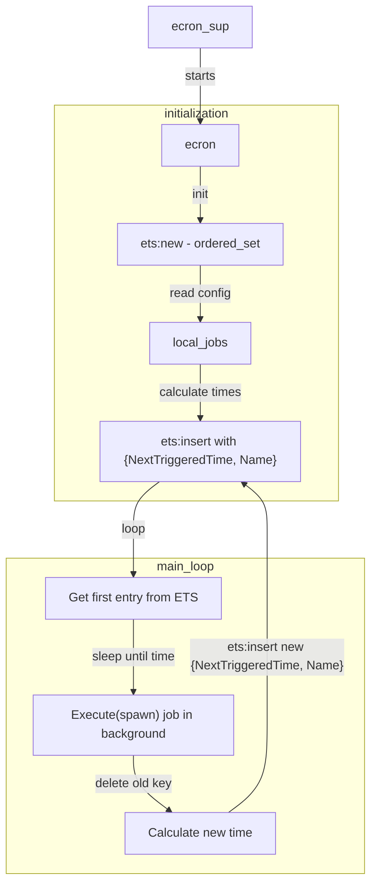

# Implementation

# Implementation

Ecron uses an efficient approach to manage job execution times and intervals:

1. The top supervisor `ecron_sup` starts first.
2. Then `ecron_sup` starts a child `ecron` (gen_server worker).
3. `ecron` will look for the configuration `{local_jobs, Jobs}` at initialization.
4. For each crontab job found, determine the next time in the future that each command must run.
5. Place those commands in the ordered_set ETS with their `{NextCorrespondingTime, Name}` to run as the key.
6. Enter `ecron`'s main loop:
    * Examine the task entry at the head of the ETS, compute how far in the future it must run.
    * Sleep for that period of time using the gen_server timeout feature.
    * On awakening and after verifying the correct time, execute the task at the head of the ETS (spawn in background).
    * Delete the old key in ETS.
    * Determine the next time in the future to run this command and place it back in the ETS at that time value.
    
Additionally, you can use `ecron:statistic(Name)` to see the job's latest 16 results and execution times.

